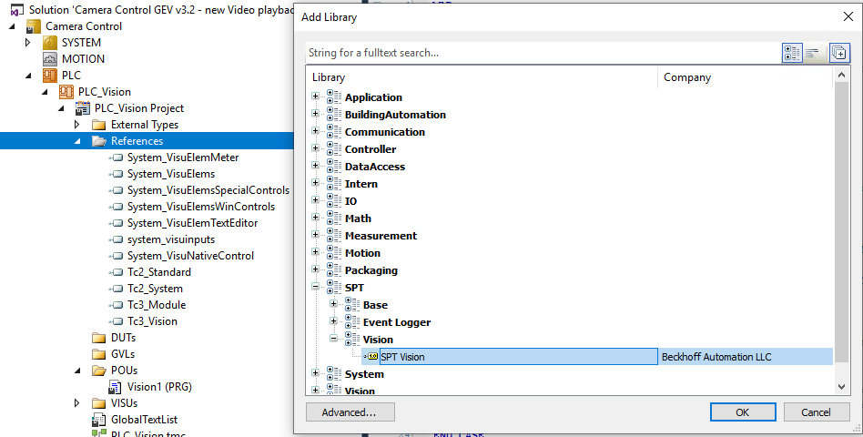

## 4026 XAE Requirements

The PLC libraries require the PackML TwinCAT package installed. To install, open a Powershell or CMD instance and run the command:
```powershell
tcpkg install TwinCAT.XAE.PLC.Lib.Tc3_PackML_V2  --no-prompt
```

## Adapting to Existing Vision Projects

You can easily make use of this new service with existing TcVision Projects. There are 4 main components that need to be addressed.

1. Add the SPT Vision Library to the References section of the PLC Project (v3.0.4 or later)

    

2. Instantiate a new FB_ImageToVideo and TriggerEvent BOOL

    ```
    VAR
    	// ImageToVideo Instance
    	Playback : FB_ImageToVideo := (CameraName := 'Camera1',
                                       JsonAttribute := '{CreateVid : 1, CameraName: "Camera1"}',
                                       FramesPerSecond := 10,
                                       TimeBeforeEvent := T#3S,
                                       TimeAfterEvent := T#3S,
                                       VideoOutputDirectory := 'C:\TcAlarmVideos',
                                       ReductionFactor := 0.25);
                                       
    	// Event Trigger Boolean
    	TriggerEvent : BOOL;
    END_VAR
    ```

3. Add the CyclicLogic call to the main  body of your POU. This **MUST** be called cyclically to work.
```
Playback.CyclicLogic();
```

4. Add the trigger logic somewhere in your program. The TriggerAlarmForVideoCapture method only needs to be called once to start processing.
```
IF TriggerEvent THEN
	TriggerEvent := FALSE;
	Playback.TriggerAlarmForVideoCapture();
END_IF
```

5. Add the AddImage method to your image aquisition loop of your program. This will add an image to the buffer of the Playback block.
```
Playback.AddImage(ipImageIn := ImageIn);
```