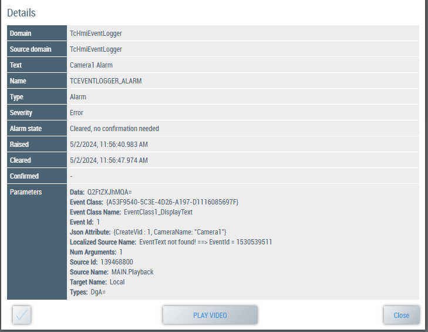

## Sample Project Locations

The sample projects will be installed in these locations:

Build 4024 TwinCAT

```C:\TwinCAT\Functions\TcEventVideoPlayback```

Build 4026 TwinCAT

```C:\Program Files (x86)\Beckhoff\TwinCAT\Functions\TcEventVideoPlayback```

In the event that the sample files are not located here, and they were selected for install, they can be found under ```C:\Program Files\Beckhoff Automation LLC\TcEventVideoPlayback```. All items selected for install can be located here after running the installer.

## TcEventVideoPlayback Service

The TcEventVideoPlayback service is installed by the EXE installer. This service will run in the background of the IPC and convert TwinCAT Vision images to video files when called from the PLC. Proper installation can be verified via the Windows Services.


## PLC Project - Quick Start Sample

For quick start purposes, a PLC sample project and the SPT_Vision library is supplied. To run the sample, follow these steps. 

1. Locate the sample ```C:\TwinCAT\Functions\TcEventVideoPlayback\TcEventVideoPlayback_PLC_Sample.tszip```

2. To open the .tszip select open project in Visual Studio or XAE Shell

3. **For 4026 only** - you will need to update the Visu profile by right-clicking the PLC project and going to the Properties page.
   

4. Load the included sample images into the TC Vision File Source

   > If using TwinCAT 4026, the files might reject unzipping in the ```C:\Program Files(x86)``` without administrator rights. Simply move the files to a location where you have write access.

5. Activate the TwinCAT project

6. Put the PLC into Run state

7. Open the Visu project and press the Run Vision button to start the vision process

   

8. Check images are streaming via the TwinCAT -> Windows-> ADS Image Watch

9. To generate a video, press the Trigger Video button on the Visu

10. Check that a video was created in the default directory ```C:\TcAlarmVideos```

#### Notes on PLC Project

- The SPT_Vision component FB_ImageAquire and the base Tc3 Vision components are supported. For the sample, the SPT_Vision component FB_ImageAquire is used. The FB_ImageToVideo function does not require FB_ImageAquire to work, and it can also be supplied with standard image pointers from the Tc3 Vision base library.

  

- The FB_ImageToVideo is configurable. You can set the directory of where the video will be recorded, as well as the Camera name and Event Logger name.

  
  
#### Common issues running the sample

##### Build Error

The first known common issue is when loading the PLC project on a brand new install. If nothing has been loaded on the system before, you will get some Tc2_System library errors like below.


To fix this, you will need to right-click the top XAE project node and select -> Unload Project, and then right-click Reload Project.


      
##### Binaries Error

The second known common issue is the TcVision binaries error when trying to activate the project, as seen below. This is due to a mismatch of the publishing system TcVision version and the one you are using.


To fix this, you must reload the tmc files for each of the FileSource TcCom objects under Vision. Make sure to do it for both.
      


## HMI Project - Quick Start Sample

Included in the package is a NuGet Package for the EventVision component. This package should be installed properly if selected. To install manually, copy the EventVision.'version'.nupkg file to the directory ```C:\TwinCAT\Functions\TE2000-HMI-Engineering\References``` for 4024, or ```C:\ProgramData\Beckhoff\NugetPackages``` for 4026.

**Running the sample**:

1. **For 4026 only** - You may need to upgrade the EventLogger control from inside the NugetPackage manager. Search for **Beckhoff.TwinCAT.HMI.EventLogger** package and select **Update**

2. Simply build the HMI project by right-clicking and selecting rebuild

3. Launch the HMI project in the browser, not live-view. A full browser is required for playback of the video files.

> If you get a blank window stating TcHmiSrv Resource is missing, that means the project needs to be rebuilt from step 1

3. Toggle the Run Program

    


4. Trigger an event

    

5. Double click the Video event to play

    


**To configure the project from start to finish**:

1. Install the **Beckhoff.TwinCAT.HMI.EventLogger** package with the NuGet Package Manager

2. On the Browse window of the NuGet Package Manager, add the **EventVision** package to the project

    

    > If the package does not appear, double check Package source has TwinCAT HMI Customer profile selected

3. Set a virtual directory of where the video files exist. Go to Server -> TcHmiSrv -> Virtual directories and add the following entry. Be aware of the Publish Configuration you are selecting. If you are using a Publish Configuration of "Remote" when Publishing the project, make sure you add the virtual directory to the matching Publish Configuration via dropdown menu on the TcHmiSrv page.

    

4. On your HMI view, add a new EventVideo Control grid

5. Modify the top 3 properties and make sure the Virtual Drive matched the Virtual Directory created in Step 3

    

6. Launch the HMI in a browser

    > The EventVideoPlayback control will only work in browser launch or fully deployed environment. HMI Live View will not allow you to play video files due to the virtual directory usage.


> - If you only see a blank playback window, try adjusting the codec that was used to record the video
>- If you get a "Waiting For Video" in place of "Play Video", try the following:
>   - Re-adding the EventVideo Control
>   - Completely remove the virtual directory and re-add
>   - Make sure Check Retires and Check Delay is set in the properties window of the control
