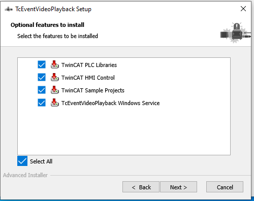
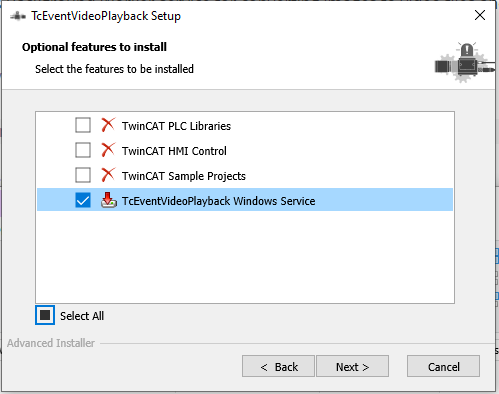

### Installing TcEventVideoPlayback

Download and run TcEventVideoPlayback.msi on both the Engineering and Runtime systems.
See details below.

There are four different parts of the project that are installed by default:

**TwinCAT PLC Libraries**

Installs the required SPT_Base, SPT_Event_Logger, and SPT_Vision libraries to hard disk and imports them into the PLC library repository

**TwinCAT HMI Control**

Installs the EventVideo HMI Control for playback of videos inside Tc HMI

**TwinCAT Sample Projects**

Installs the Quick Start sample projects. Located at ```TwinCAT\Functions\TcEventVideoPlayback```.

**TcEventVideoPlayback Windows Service**

Installs the Windows Background Worker service for converting images to video files and storing locally



### Installing Runtime Only

This is what you would select for a TwinCAT XAR only system. Only the service is required to be installed and it will run in the background.




### Installer Notes

The sample projects, HMI nuget package, and PLC libraries will be installed wherever the user selects for the install process. However, the samples will also be located under:

Build 4024 TwinCAT

```C:\TwinCAT\Functions\TcEventVideoPlayback```

Build 4026 TwinCAT

```C:\Program Files (x86)\Beckhoff\TwinCAT\Functions\TcEventVideoPlayback```

The installer internally calls the RepTool to install the PLC libraries for you if a PLC XAE profile is available. The installer will also install the HMI nuget package within:

Build 4024 TwinCAT

```C:\TwinCAT\Functions\TE2000-HMI-Engineering\References```

Build 4026 TwinCAT

```C:\ProgramData\Beckhoff\NugetPackages```
