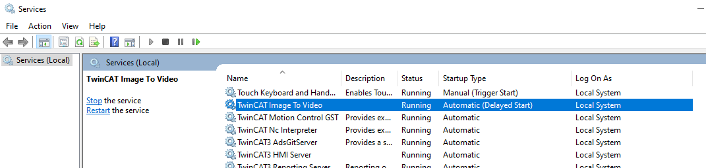
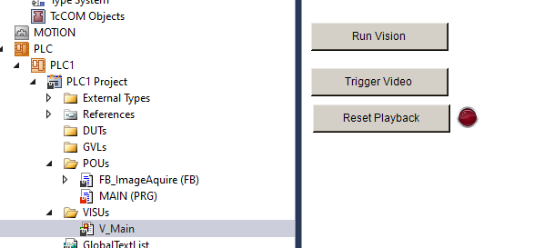
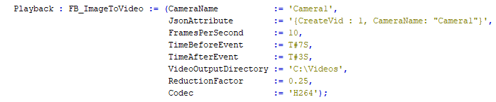
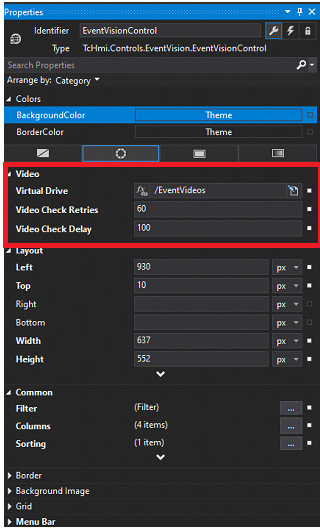

# Event Video Playback

This repository includes both the source files and the release package for the TwinCAT Event Video Playback package. The package provides an easy to use PLC interface for assembling images captured with TwinCAT Vision into a single video file. When the video file is created, a corresponding alarm event is logged into the TwinCAT Event Logger for later viewing. In addition, an HMI Control component is supplied for easy viewing and playback of logged video events on TwinCAT HMI.

## Getting Started!

Instead of cloning the source repository for this project, start with the installer zip files located in the [Releases section](https://github.com/Beckhoff-USA-Community/TC_EventVideoPlayback/releases) of this repository. The release package will include a sample PLC project, sample HMI project, PLC library, and the required Windows service installer. 

## TwinCAT Image to Video Service

To use the Event Video Playback feature, you must first install the ImageToVideo service. This service will run in the background of the IPC and convert TwinCAT Vision images to video files when called from the PLC.

Install the service via the supplied MSI installer file, and you can verify with the Windows Services.

## PLC Project

For quick start purposes, a PLC sample project and the SPT_Vision library is supplied. To run the sample, follow these steps.

1. Open PLC project and install the SPT_Vision library

2. Activate the TwinCAT project

3. Load the included sample images into the TC Vision File Source

4. Put the PLC into Run state

5. Open the Visu project and press the Run Vision button to start the vision process

   

6. Check images are streaming via the TwinCAT -> Windows-> ADS Image Watch

7. To generate a video, press the Trigger Video button on the Visu

8. Check that a video was created in the default directory C:\Videos

#### Notes on PLC Project

- The SPT_Vision component FB_ImageAquire and the base Tc3 Vision components are supported. For the sample, the SPT_Vision component FB_ImageAquire is used. The FB_ImageToVideo function does not require FB_ImageAquire to work, and it can also be supplied with standard image pointers from the Tc3 Vision base library.

  

- The FB_ImageToVideo is configurable. You can set the directory of where the video will be recorded, as well as the Camera name and Event Logger name.

  
  
  > [!NOTE]
  >
  > If you are not able to play the video files on your system due to codec warning, try to adjust the codec settings; "Default", "AVC", "H264". You should be able to simply double click the video file and play it in Windows Media Player.

## HMI Control Component

Included in the package is a NuGet Package for the EventVision component. To install, copy the EventVision.'version'.nupkg file to the directory C:\TwinCAT\Functions\TE2000-HMI-Engineering\References.

To configure the project:

1. Install the **Beckhoff.TwinCAT.HMI.EventLogger** package with the NuGet Package Manager

2. On the Browse window of the NuGet Package Manager, install the **EventVision** package

   > [!TIP]
   >
   > If the package does not appear, double check Package source has TwinCAT HMI Customer profile selected

3. Set a virtual directory of where the video files exist. Go to Server -> TcHmiSrv -> Virtual directories and add the following entry.

   

4. On your HMI view, add a new EventVideo Control grid

5. Modify the top 3 properties and make sure the Virtual Drive matched the Virtual Directory created in Step 3

   

6. Launch the HMI in a browser

   

   > [!IMPORTANT]
   >
   > The EventVideoPlayback control will only work in browser launch or fully deployed environment. HMI Live View will not allow you to play video files due to the virtual directory usage.

   

7. Double click the Video event to play

   

> [!NOTE]
>
> - If you only see a blank playback window, try adjusting the codec that was used to record the video
> - If you get a "Waiting For Video" in place of "Play Video", try the following:
>   - Re-adding the EventVideo Control
>   - Completely remove the virtual directory and re-add
>   - Make sure Check Retires and Check Delay is set in the properties window of the control

## Dependencies

<u>C# Service (only if building from source):</u>

- Visual Studio Pro 2022
- ?

<u>PLC:</u>

- TwinCAT 3 build 4024 or higher
- TF7000 
- SPT_Vision Library
- ImageToVideo Service

<u>HMI:</u>

- Beckhoff.TwinCAT.HMI.EventLogger NuGet Package

- EventVideo NuGet Package

  

## How to get support

Should you have any questions regarding the provided sample code, please contact your local Beckhoff support team. Contact information can be found on the official Beckhoff website at https://www.beckhoff.com/en-us/support/.

## Disclaimer

All sample code provided by Beckhoff Automation LLC are for illustrative purposes only and are provided “as is” and without any warranties, express or implied. Actual implementations in applications will vary significantly. Beckhoff Automation LLC shall have no liability for, and does not waive any rights in relation to, any code samples that it provides or the use of such code samples for any purpose.